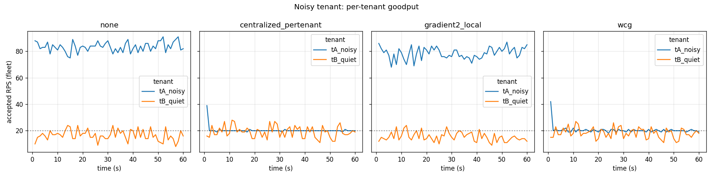

# WCG — Weighted Capacity Gossip

A rate-limiting algorithm for distributed systems that combines **local load-awareness** (per-server adaptive concurrency, à la Netflix's Gradient2) with **global fairness** (per-tenant rate budgets, à la Redis-style limiters) — **without a centralized coordinator**.



> _Noisy-tenant scenario: one tenant (blue) offers 5× their allotted rate against a quiet tenant (orange). Left two panels — no limiter / pure local adaptive — the noisy tenant starves the quiet one. Right two panels — centralized per-tenant / WCG — both tenants get their fair share._

## The problem

Most rate limiters pick one of two camps:

| Approach | Fair? | Load-aware? | Bottleneck |
|---|---|---|---|
| Centralized token bucket (Redis) | ✓ | ✗ | the central store |
| Pure local adaptive (Netflix concurrency-limits) | ✗ | ✓ | none |

A noisy tenant under pure-local adaptive starves the rest. A centralized limiter under heterogeneous server health routes traffic to dying nodes anyway. There is no widely-deployed algorithm that gives both at fleet scale without a coordination bottleneck.

## The idea

Each server already knows its own real-time safe capacity `C_i` via adaptive measurement (Gradient2 over latency + queue depth). If servers **gossip** that number to each other, then every server can compute its share of the fleet — `C_i / C_total` — and use that ratio to size per-tenant token buckets locally:

    rate_{i,t} = G_t × (C_i / C_total)

where `G_t` is tenant `t`'s globally-configured RPS budget. The local adaptive signal *is* the fairness weight. A degraded server's `C_i` shrinks, so its share of every tenant's budget shrinks; traffic naturally migrates to healthier peers. No coordinator, no per-request RPC.

Admission requires both:
1. The tenant has a token in its local bucket of rate `rate_{i,t}`, **AND**
2. The server's in-flight count is below `C_i`.

The conjunction is the safety net — a tenant having budget does not matter if the server itself is overloaded.

## Try it (30 seconds)

```sh
git clone https://github.com/emam07/wcg-gossip.git
cd wcg-gossip
go run ./cmd/sim                 # writes 16 CSVs to results/
python notebooks/analyze.py      # writes results/summary.csv
```

Requires Go ≥ 1.22 and Python ≥ 3.10 (`pip install pandas matplotlib` for the analysis).

Plots are reproducible from `notebooks/plots.ipynb`.

## Phase-1 results

Discrete-event simulator, 3 servers × 2 tenants × 60 s, four limiters compared across three failure scenarios.

| scenario | limiter | tA RPS | tB RPS | Jain | p99 max |
|---|---|---:|---:|---:|---:|
| **noisy_tenant** | none | 83.3 | 16.7 | 0.693 | **6 216 ms** |
| | gradient2_local | 78.3 | 15.6 | 0.692 | 345 ms |
| | centralized_pertenant | 20.0 | 19.2 | 1.000 | 234 ms |
| | **wcg** | **20.1** | **18.4** | **0.998** | **203 ms** |
| **heterogeneous** | centralized_pertenant | 32.8 | 30.6 | 0.999 | **18 625 ms** |
| | **wcg** | 32.2 | 30.3 | 0.999 | **789 ms** |
| **shock** | centralized_pertenant | 27.2 | 25.8 | 0.999 | **16 593 ms** |
| | **wcg** | 26.4 | 24.3 | 0.998 | **1 814 ms** |

Headline takeaways:

- **Fairness.** WCG matches centralized per-tenant on Jain's index (0.998 vs 1.000) while being load-aware. Gradient2-alone is no fairer than no limiter at all (0.692 vs 0.693).
- **Load awareness.** Under a slow server or sudden capacity shock, centralized limiters keep routing traffic blindly — fleet p99 reaches 16–18 seconds. WCG bounds p99 to under 2 seconds in both cases.
- **No bottleneck.** Gossip carries one float per server per ~500 ms. No central store, no per-request RPC.
- **Gossip is forgiving.** A 50× sweep from 100 ms to 5 s gossip interval degrades Jain's fairness by less than 0.4%. The algorithm tolerates substantial staleness.
- **Survives partition.** Splitting the gossip mesh at t = 20 s and healing at t = 40 s shows no p99 meltdown; WCG under-admits ~6% during the split and recovers within one gossip interval.

Full numbers, scenario descriptions, and caveats: [docs/results.md](docs/results.md).

## How it works

Three composable layers:

1. **Local adaptive limiter** ([internal/limiter/gradient2.go](internal/limiter/gradient2.go)) — port of Netflix's Gradient2: tracks `rtt_min` vs `rtt_actual` EMAs; shrinks the concurrency limit when latency rises above the floor. Produces `C_i`.
2. **Gossip mesh** ([internal/gossip/gossip.go](internal/gossip/gossip.go)) — each node periodically broadcasts `C_i` to peers with configurable delay and loss. Phase-1 uses an in-memory mesh; Phase-2 will swap in `hashicorp/memberlist`.
3. **Weighted fairness allocator** ([internal/fairness/fairness.go](internal/fairness/fairness.go)) — per-tenant token bucket. Reweight is called on every gossip tick to refresh refill rates as local / fleet capacity drifts.

The composition lives in [internal/limiter/wcg.go](internal/limiter/wcg.go) — about 80 lines.

## Project layout

```
wcg-gossip/
├── cmd/sim/                 # simulator entry point (16 experiments)
├── docs/
│   ├── design.md            # algorithm spec
│   └── results.md           # Phase-1 findings + full table
├── internal/
│   ├── sim/                 # discrete-event scheduler
│   ├── server/              # M/M/N queueing server
│   ├── workload/            # Poisson traffic generator
│   ├── gossip/              # in-memory mesh w/ delay & loss
│   ├── fairness/            # per-tenant weighted bucket
│   ├── limiter/             # AIMD, Gradient2, Centralized, WCG
│   ├── metrics/             # single- and multi-tenant collectors
│   └── scenario/            # heterogeneous, noisy_tenant, shock
├── notebooks/
│   ├── analyze.py           # summary stats → results/summary.csv
│   └── plots.ipynb          # the four figures
└── results/                 # CSVs, summary, PNGs
```

## Reading order if you want to dig in

1. [docs/design.md](docs/design.md) — algorithm spec (one page)
2. [docs/results.md](docs/results.md) — what the experiments showed
3. [internal/limiter/wcg.go](internal/limiter/wcg.go) — the algorithm itself
4. [internal/scenario/scenarios.go](internal/scenario/scenarios.go) — how the four limiters are wired into one experiment harness
5. [cmd/sim/main.go](cmd/sim/main.go) — top-level experiment runner

## Caveats

- **This is a simulator, not a deployment.** All numbers come from a discrete-event simulation with idealized network and service-time models.
- **WCG matches Gradient2 on raw throughput / latency in load-aware-only scenarios.** Its win is the fairness layer; if you only have one of the two problems, simpler algorithms are easier to operate.
- **`rtt_min` calibration matters.** The simulator uses `80 ms + uniform(0, 40 ms)` service times — low-variance, which is the workload Gradient2 was designed for. Heavy-tailed (exponential, log-normal) service times degrade the gradient signal and would need a percentile-based floor instead of a true min.
- **Partition response is graceful, not active.** Under a static partition with steady offered load, WCG under-admits by ~6% in the partitioned-off node because stale peer views keep `C_total` artificially high. It recovers within one gossip interval after heal. A more aggressive scenario (asymmetric load during partition) would expose this more sharply — see [docs/results.md](docs/results.md) Q5.

## Inspired by

- [Netflix concurrency-limits](https://github.com/Netflix/concurrency-limits) — the Gradient2 algorithm
- [Envoy adaptive concurrency filter](https://www.envoyproxy.io/docs/envoy/latest/configuration/http/http_filters/adaptive_concurrency_filter) — production deployment of the same family
- SWIM gossip protocol (Das, Gupta, Motivala, 2002)
- Jain, Chiu, Hawe (1984), *A Quantitative Measure of Fairness and Discrimination for Resource Allocation in Shared Computer Systems*
- Brakmo, Peterson (1995), *TCP Vegas: End-to-end congestion avoidance on a global Internet*
