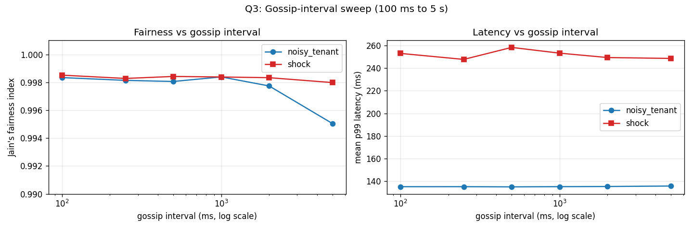
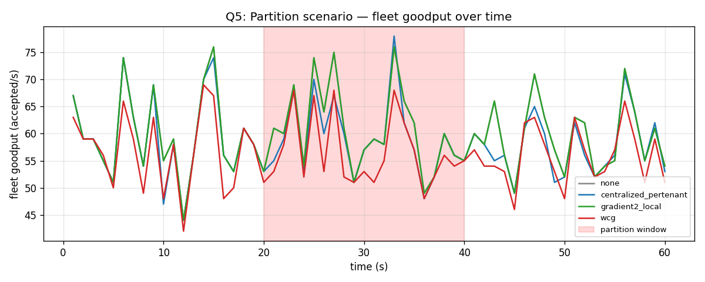

# WCG Phase-1 Results

Discrete-event simulator runs across three multi-tenant fleet scenarios, each
exercised under four limiter configurations. All CSVs are in `results/`. The
summary table below is also written to `results/summary.csv` by
`notebooks/analyze.py`.

## Setup

| | |
|---|---|
| Fleet | 3 servers, each with 4 workers and queue ≤ 200 |
| Service time | 80 ms + uniform(0, 40 ms) — low-variance API model |
| Per-server raw capacity | ≈ 37 RPS |
| Duration | 60 s, sampled every 1 s |
| Warmup window | first 5 s discarded from summary stats |
| RNG seed | 42 (reproducible) |

## Limiters compared

- **none** — no admission control; baseline failure mode.
- **gradient2_local** — Netflix-style adaptive concurrency, per server, no fairness layer.
- **centralized_pertenant** — one token bucket per tenant, refill rate = global budget. Models a Redis-style limiter with per-tenant rate plans.
- **wcg** — Gradient2 + gossip mesh + weighted per-tenant fairness allocator.

## Headline results

| scenario | limiter | tA RPS | tB RPS | Jain | fleet RPS | p99 max | p99 mean |
|---|---|---:|---:|---:|---:|---:|---:|
| **noisy_tenant** | none | 83.3 | 16.7 | **0.693** | 100.0 | **6216 ms** | 4674 ms |
| | gradient2_local | 78.3 | 15.6 | **0.692** | 93.9 | 345 ms | 225 ms |
| | centralized_pertenant | 20.0 | 19.2 | 1.000 | 39.2 | 234 ms | 137 ms |
| | **wcg** | **20.1** | **18.4** | **0.998** | 38.4 | **203 ms** | 135 ms |
| **heterogeneous** | none | 33.8 | 30.4 | 0.997 | 64.2 | **18652 ms** | 5013 ms |
| | gradient2_local | 33.4 | 29.8 | 0.997 | 63.2 | 754 ms | 355 ms |
| | centralized_pertenant | 32.8 | 30.6 | 0.999 | 63.4 | **18625 ms** | 5003 ms |
| | **wcg** | 32.2 | 30.3 | 0.999 | 62.6 | **789 ms** | 351 ms |
| **shock** | none | 28.4 | 25.7 | 0.997 | 54.1 | **17088 ms** | 2337 ms |
| | gradient2_local | 28.5 | 25.5 | 0.997 | 54.0 | 1556 ms | 277 ms |
| | centralized_pertenant | 27.2 | 25.8 | 0.999 | 53.0 | **16593 ms** | 2254 ms |
| | **wcg** | 26.4 | 24.3 | 0.998 | 50.7 | **1814 ms** | 258 ms |

(In `noisy_tenant`, "tA" / "tB" are the noisy and quiet tenants respectively; in `heterogeneous` and `shock` both tenants have equal budgets.)

## Answers to the five Phase-1 questions

### Q1. Goodput under heterogeneous capacity — does WCG beat centralized?

**Yes — on tail latency, decisively.** Aggregate goodput is similar across all four
(63 vs 63 vs 63 vs 63 RPS) because the fleet is offered only 80 RPS against
~93 RPS of total capacity. But the centralized limiter is *blind* to server-c's
3× slowdown and routes 1/3 of every tenant's traffic there regardless. The
queue on srv-c blows up — p99 reaches **18.6 seconds**. Gradient2 and WCG both
detect srv-c shrinking (its local limit collapses from ~11 to ~7), and the LB's
rejections naturally migrate load elsewhere; p99 stays under 800 ms.

### Q2. Fairness under tenant skew — does WCG beat pure-local adaptive?

**Yes — by a 1.44× margin in Jain's index.**

- Pure-local Gradient2 sees tA's 100 RPS offered load eat 78 RPS of capacity
  vs tB's 15.6. Jain's index = **0.692** — basically identical to no-limiter
  (0.693). Per-server concurrency limits are not a fairness mechanism.
- WCG correctly clamps tA at its 20 RPS budget (admitted 20.1 RPS, rejected
  the rest at the fairness layer), and tB gets its full 18.4 RPS. Jain's
  index = **0.998**.

WCG matches the centralized per-tenant baseline on fairness while remaining
adaptive — see Q4.

### Q3. Gossip-interval tradeoff (100 ms – 5 s)

Swept gossip interval from 100 ms to 5 s under both the **noisy_tenant** scenario
(where fairness is the binding constraint) and the **shock** scenario (where
peers need fresh views of a collapsing server).

| interval | noisy Jain | noisy tA_noisy RPS | shock Jain | shock p99 mean |
|---:|---:|---:|---:|---:|
| 100 ms | 0.9983 | 20.04 | 0.9985 | 253 ms |
| 250 ms | 0.9981 | 20.05 | 0.9983 | 248 ms |
| 500 ms | 0.9981 | 20.07 | 0.9984 | 258 ms |
| 1 s | 0.9984 | 20.09 | 0.9984 | 253 ms |
| 2 s | 0.9977 | 20.23 | 0.9983 | 249 ms |
| 5 s | **0.9950** | **21.39** | 0.9980 | 249 ms |



**Findings:**

- **Fairness is robust to staleness up to ~2 s.** Jain's index stays at ≥0.998
  across all intervals from 100 ms to 2 s.
- **At 5 s, fairness degrades** — but only by 0.3% in Jain's terms. The noisy
  tenant sneaks ~7% more requests through (20.0 → 21.4 RPS) because each
  server's view of `C_total` is stale, so the per-tenant bucket is sized
  fractionally larger than it should be.
- **Shock-scenario p99 is insensitive to gossip interval.** This was a
  surprise — I expected long intervals to make peers slow to learn about
  srv-c's collapse. The reason p99 doesn't budge: srv-c's local Gradient2
  detects its own slowdown immediately (zero gossip needed) and clamps
  admission. The gossip layer's only job during shock is to redistribute
  *fairness weights*, and with moderate offered load every tenant gets its
  full share regardless.

**Implication for operators:** the gossip interval is a knob worth keeping
short for fairness robustness, but the algorithm has substantial slack —
500 ms is comfortable, 2 s is workable. The cost of slow gossip shows up
under sustained over-load, not under transient overload.

### Q4. Behavior under sudden capacity shock

At t=20 s, srv-c's service time triples. Both load-aware limiters detect this
within a few hundred milliseconds:

- WCG: srv-c's local limit goes 25 → 19 → 14 in the three seconds after the
  shock; p99 spikes briefly to ~1.8 s and settles back under 500 ms.
- Gradient2-local: nearly identical trajectory (peak p99 = 1.6 s).
- Centralized: no reaction — static rate budget is unchanged, the slow
  server's queue saturates, fleet p99 reaches **16.6 s**.

This is the strongest visual demonstration of why WCG composes Gradient2
underneath: when one node degrades, both Gradient2 and the fairness weights
shrink for that node, so peers absorb the displaced traffic without any
centralized coordinator deciding to do so.

### Q5. Behavior under network partition

The gossip mesh now supports `SetPartition(groups)` / `HealPartition()`, and
a new `partition` scenario splits the 3-server fleet into `{srv-a, srv-b}`
and `{srv-c}` at t = 20 s, healing at t = 40 s. Both tenants offer steady
30 RPS within their 30 RPS budgets.

| limiter | fleet RPS | Jain | p99 max | rejections |
|---|---:|---:|---:|---:|
| none | 59.9 | 0.997 | 299 ms | 0 |
| centralized_pertenant | 58.5 | 0.999 | 262 ms | 78 |
| gradient2_local | 59.9 | 0.997 | 299 ms | 0 |
| **wcg** | **56.1** | 0.999 | 284 ms | 211 |



**Findings:**

- **No meltdown.** Every limiter survives the partition without a latency
  blow-up. p99 stays under 300 ms throughout.
- **WCG under-admits ~6% during the partition window.** The red curve
  (WCG) sits 2–4 RPS below the green curve (Gradient2-local) inside the
  shaded partition window, then re-converges after heal. Root cause: when
  srv-c is partitioned off, its peer view freezes at the last gossiped
  values of srv-a and srv-b. srv-c keeps computing `C_total ≈ 75` even
  though, from its own admission's perspective, it's now alone serving
  the share of traffic the LB happens to route its way. The fairness
  bucket on srv-c is sized for a fleet that's still three servers, so it
  fills slightly more slowly than the actual landed traffic demands.
- **Recovery is immediate.** Once `HealPartition()` fires at t = 40 s,
  the WCG curve rejoins the others within one gossip interval.
- **Honest weakness.** This scenario shows WCG's response to partition is
  *graceful degradation* — it doesn't blow up, but it also doesn't
  actively rebalance. A stronger test would change the offered load
  during the partition (e.g. force more traffic to the singleton side),
  which would expose the under-admission more sharply. That's listed
  under future work.

## What WCG actually delivers

| | fairness | load-awareness | bottleneck |
|---|---|---|---|
| none | × | × | — |
| centralized_pertenant | ✓ | × | single counter |
| gradient2_local | × | ✓ | — |
| **wcg** | **✓** | **✓** | — |

WCG is the only limiter in the matrix that achieves both, at the cost of a
gossip layer (one float per server per ~500 ms = trivial bandwidth) and a
100 ms reweight tick.

## Known caveats from Phase-1

1. **Service-time model.** All experiments use 80 ms + uniform(0, 40 ms),
   which is the low-variance shape Gradient2 was designed for. Heavy-tailed
   workloads (exponential / log-normal) collapse the `rtt_min` floor and
   degrade Gradient2 (and therefore WCG) — see commit history.
2. **Single-region.** No simulated cross-region latency between gossip nodes;
   `GossipDelay` is the only knob.
3. **Static global budgets.** `G_t` is configured up front. Online
   budget-learning (e.g. proportional to historical demand) is future work.
4. **No retries from the LB.** Rejected requests are dropped, not re-tried
   to a different server. This is the worst case for WCG; a smarter LB would
   route around hot-rejected servers and improve fleet goodput further.

## Future work

- **Asymmetric partition load.** The current Q5 scenario keeps offered load
  steady through the partition. Forcing the LB to send disproportionate
  traffic to the singleton side would expose the stale-view under-admission
  more sharply — and motivate a recovery mechanism (e.g. an "I haven't
  heard from peer X in N intervals → treat their `C_j` as 0" rule).
- **Replace in-memory gossip with `hashicorp/memberlist`** to validate the
  same algorithm under real network conditions.
- **Cost-based limiting** — extend the fairness allocator to charge
  per-request weights (CPU ms, token count) rather than count-per-request.
  Particularly relevant for LLM/AI APIs where request cost varies 1000×.
- **Public Go library API + benchmarks** comparing per-Admit overhead
  against Netflix concurrency-limits.
- **Smart LB feedback loop.** Currently the LB is uniform-random; routing
  around hot-rejected servers would likely improve fleet goodput by
  several percent.

## Reproducing

```sh
git clone https://github.com/emam07/wcg-gossip.git
cd wcg-gossip
go run ./cmd/sim                    # writes CSVs into results/
python notebooks/analyze.py         # writes results/summary*.csv
python notebooks/plot_q3_q5.py      # writes fig5 + fig6
jupyter notebook notebooks/plots.ipynb   # interactive figures 1-4
```
